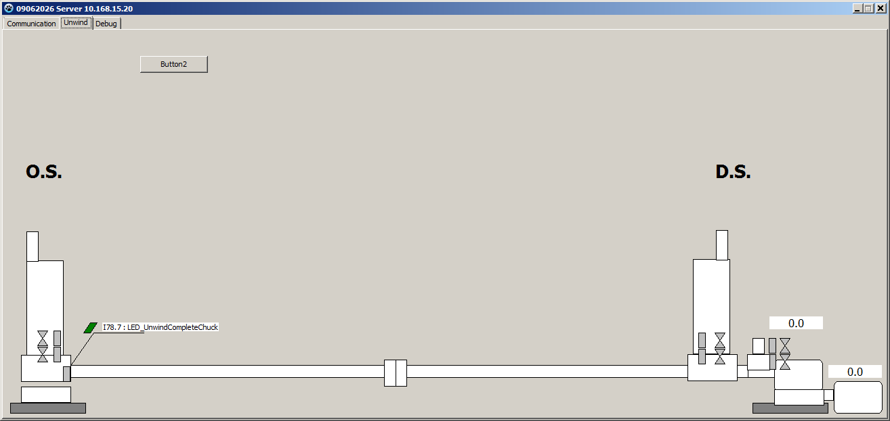

# Slitter-Monitor-P3
Slitter Monitor P3

Keyword:

- {$modeswitch advancedrecords}

- Additional procedure in variable

- Function in data type

- Function in variable

- Custom Polygon in to shape

- Shape polygon

- New kind of tooltip using shape polygon

- Loop repeat until

 
